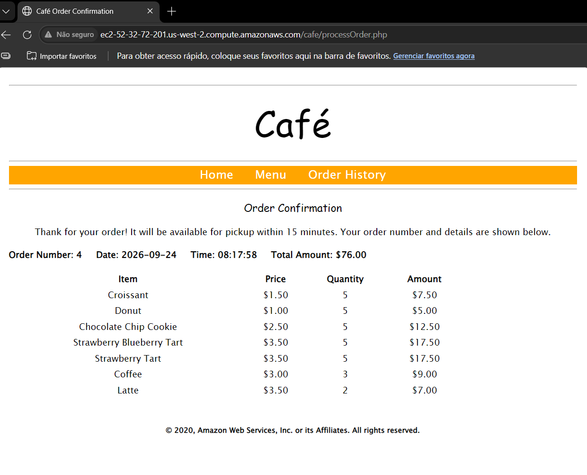
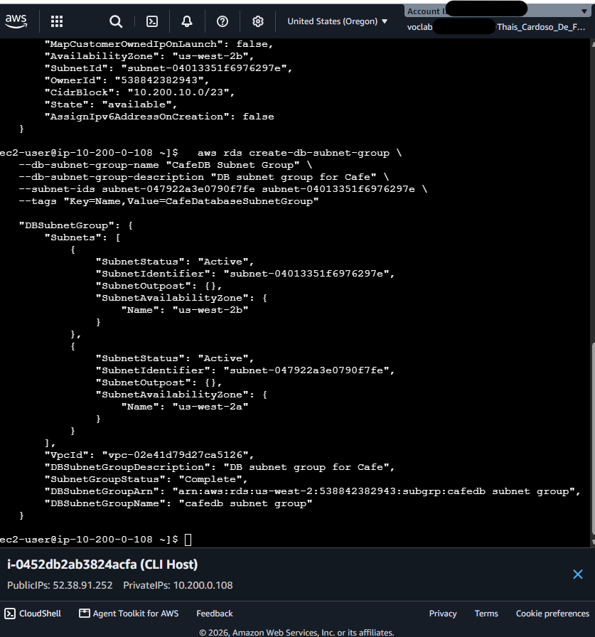
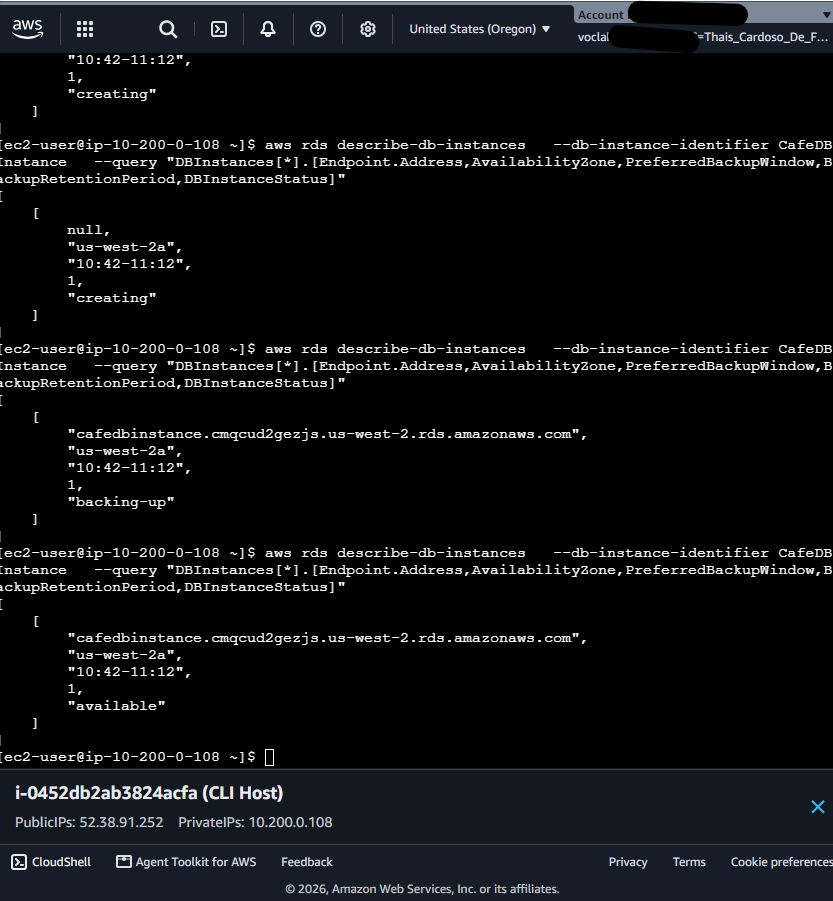
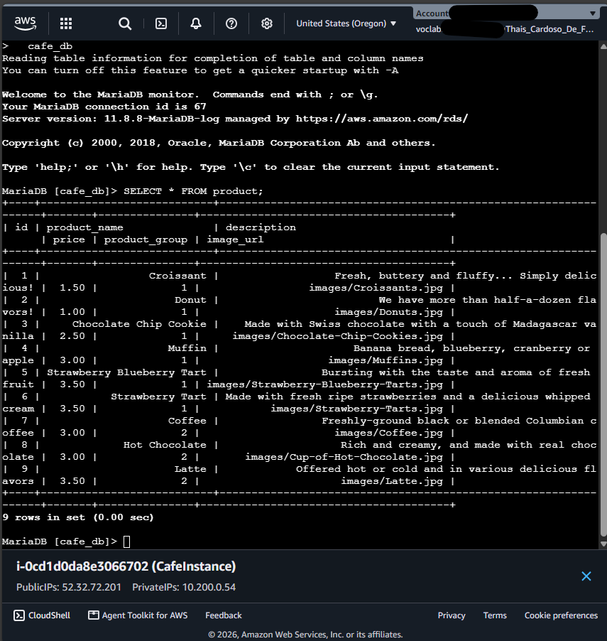
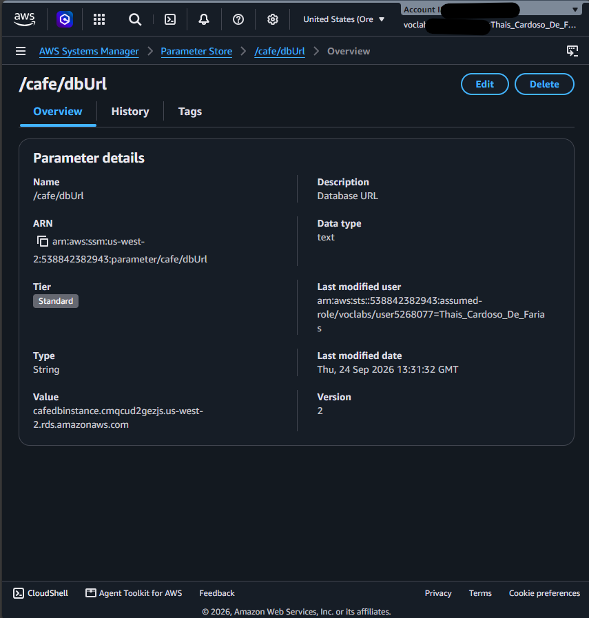
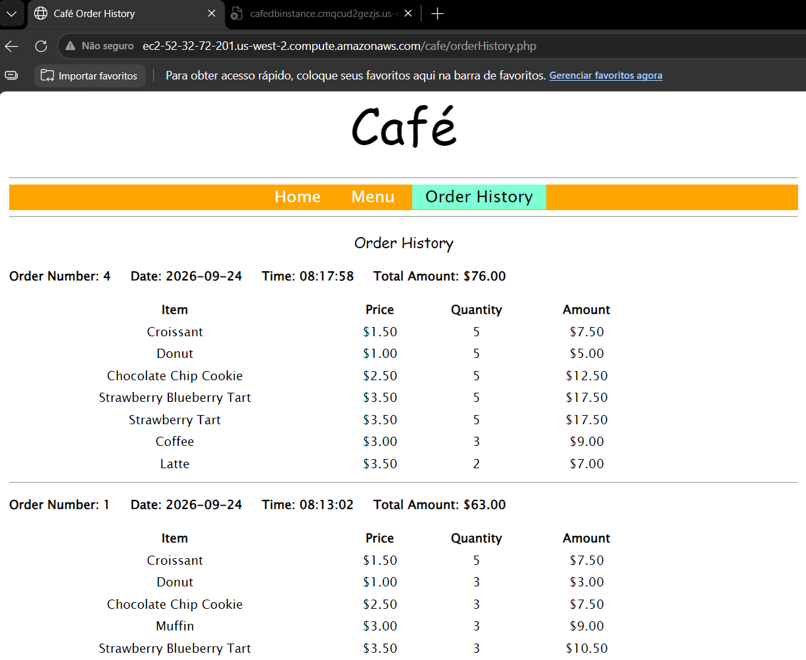
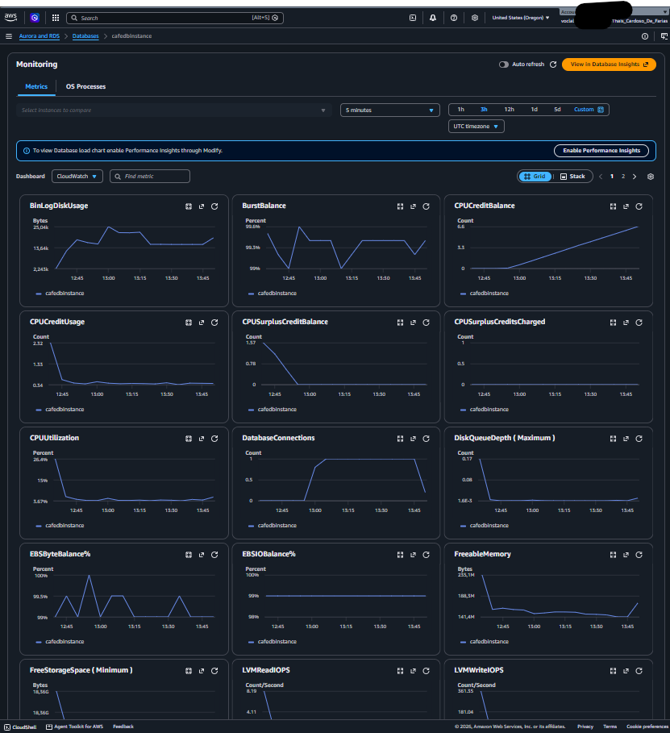

# ☕ Migração de Banco de Dados de EC2 para Amazon RDS (MariaDB)

Projetado para demonstrar a transição de uma arquitetura monolítica (onde aplicação web e banco de dados residiam no mesmo servidor EC2) para uma arquitetura desacoplada, escalável e segura na **AWS**, utilizando o **Amazon RDS (Relational Database Service)**.

---

## 🛠️ Tecnologias e Serviços Utilizados

- **Amazon RDS (MariaDB):** Gerenciamento do banco de dados relacional com alta disponibilidade e backups automatizados.
- **Amazon EC2:** Servidor de hospedagem da aplicação web ("Café") e estaca de gerenciamento (CLI Host).
- **AWS Systems Manager (Parameter Store):** Armazenamento centralizado e seguro do endpoint do banco de dados desacoplado da aplicação.
- **Amazon VPC & Security Groups:** Isolamento de rede com subnets privadas em diferentes Zonas de Disponibilidade (Multi-AZ) e controle estrito de portas (3306).
- **AWS CLI:** Provisionamento infraestrutural via linha de comando.
- **Amazon CloudWatch:** Monitoramento contínuo de métricas da instância RDS (uso de CPU, conexões ativas, memória livre).

---

## 📐 Visão Geral da Arquitetura

1. **Rede:** Criação de um *DB Subnet Group* englobando duas subnets privadas em Zonas de Disponibilidade distintas para suporte a alta disponibilidade.
2. **Segurança:** Configuração de *Security Groups* garantindo que apenas a instância do servidor web (`CafeInstance`) possa se comunicar com a porta do MariaDB (`3306`).
3. **Persistência de Dados:** Exportação dos dados locais (`mysqldump`) e importação criptografada via SSL para o Amazon RDS.
4. **Desacoplamento:** Atualização do parâmetro `/cafe/dbUrl` no *SSM Parameter Store* para que a aplicação redirecione as requisições ao novo endpoint.

---

## 🚀 Passo a Passo e Evidências da Execução

### 1. Registro de Dados Iniciais na Aplicação
Validação inicial da aplicação web funcionando com o banco de dados local na instância EC2 antes da migração.

---

### 2. Criação da Infraestrutura de Rede via AWS CLI
Provisionamento do grupo de subnets privadas (*DB Subnet Group*) e definição do *Security Group* restritivo para o banco de dados.

---

### 3. Provisionamento da Instância Amazon RDS
Criação e acompanhamento do status do RDS MariaDB até o estado **Available**, obtendo o Endpoint oficial para conexão.

---

### 4. Migração dos Dados via Conexão Segura SSL
Exportação do dump `.sql` local e carga na instância remota do RDS utilizando certificado SSL fornecido pela AWS (`global-bundle.pem`).

---

### 5. Desacoplamento da Configuração com SSM Parameter Store
Atualização do parâmetro `/cafe/dbUrl` com o novo Endpoint do RDS, garantindo que o código da aplicação leia dinamicamente o endereço do banco.

---

### 6. Validação do Funcionamento da Aplicação Migrada
Acesso ao histórico de pedidos da aplicação web confirmando a integridade da leitura dos dados conectando-se com sucesso ao Amazon RDS.

---

### 7. Monitoramento da Infraestrutura com CloudWatch
Visualização dos gráficos de desempenho (utilização de CPU, vazão de rede e conexões ativas) na aba de monitoramento do RDS.

---

## 🧠 Desafios Enfrentados & Solução de Problemas (Troubleshooting)

- **Compatibilidade de Versão do Engine:** A versão padrão legada descrita no roteiro do lab não estava mais disponível na região. Foi feita a consulta de versões ativas via `aws rds describe-db-engine-versions` e ajustada para a versão suportada.
- **Ajuste de Parâmetros Globais do Banco (`require_secure_transport`):** Como o RDS limita privilégios `SUPER` por ser um serviço gerenciado, alterações de variáveis do MariaDB foram tratadas através da criação e associação de um **DB Parameter Group customizado**, desativando a exigência de SSL forçado para conexões legadas da aplicação PHP.

---

## 📈 Principais Aprendizados

- Desacoplamento de arquiteturas monolíticas na nuvem.
- Implementação das melhores práticas de segurança (subnets privadas e segurança em camadas).
- Gerenciamento de variáveis de ambiente com AWS Systems Manager.
- Solução de problemas práticos de permissão e parâmetros de configuração no Amazon RDS.
